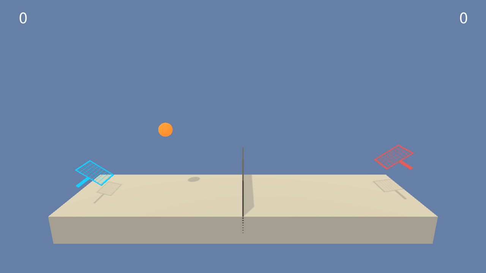

# Project 3. Collaboration and Competition

## 1. Environment

In this environment, two agents control rackets to bounce a ball over a net. If an agent hits the ball over the net, it receives a reward of +0.1. If an agent lets a ball hit the ground or hits the ball out of bounds, it receives a reward of -0.01. Thus, the goal of each agent is to keep the ball in play.

The observation space consists of 8 variables corresponding to the position and velocity of the ball and racket. Each agent receives its own, local observation. Two continuous actions are available, corresponding to movement toward (or away from) the net, and jumping.

 

The task is episodic, and in order to solve the environment, the agents must get an average score of +0.5, over 100 consecutive episodes, after taking the maximum over both agents. That is, after each episode we get the maximum score of the two agents for that episode, and finally we get the average over the last 100 episodes.

The environment has been built using the Unity Machine Learning Agents Toolkit ([ML-Agents](https://github.com/Unity-Technologies/ml-agents)).

## 2. Project Structure

The project is implemented in Python 3 using the Pytorch library, and it has the following files:

* `ddpg_agent.py`: The *Agent*, *OUNoise* and *ReplayBuffer* classes.
* `model.py`: The *Actor* and *Critic* classes.
* `p3.py`: The main Python file containing the *main* function.
* `Readme.md`: This file.
* `Report.pdf`: A description of the Python code and the learning algorithm used.
* `model_actor.pth` and `model_critic.pth`: Saved weights for the  actor and critic networks of the agent.

## 3. Installation

You need Python 3 and the following libraries with the specified version dependencies:

* tensorflow==1.7.1
* Pillow>=4.2.1
* matplotlib
* numpy>=1.11.0
* jupyter
* pytest>=3.2.2
* docopt
* pyyaml
* protobuf==3.5.2
* grpcio==1.11.0
* torch==0.4.0
* pandas
* scipy
* ipykernel
* unityagents==0.4.0

where unityagents is the Python library for interacting with the Unity learning environment.

To install Python 3 in Ubuntu through `apt-get`, enter:

~~~c
$ sudo apt-get update
$ sudo apt-get install python3
~~~

To install `pip3`, the Python 3 package installer, enter:

~~~c
$ sudo apt-get install python3-pip
~~~

Then you can use `pip3` to install all the required dependencies, for example:

~~~c
$ pip3 install tensorflow==1.7.1
~~~

In order to execute this project you don't need to install Unity. This is because the environment has already been built, and you can download it from one of the links below. You only need to select the environment that matches your operating system:

* Linux: [click here](https://s3-us-west-1.amazonaws.com/udacity-drlnd/P3/Tennis/Tennis_Linux.zip)
* Mac OsX: [click here](https://s3-us-west-1.amazonaws.com/udacity-drlnd/P3/Tennis/Tennis.app.zip)
* Windows (64-bit): [click here](https://s3-us-west-1.amazonaws.com/udacity-drlnd/P3/Tennis/Tennis_Windows_x86_64.zip)

Then place the file in the `p3_collab-compet` folder and decompress the file.

If you prefer to use an environment without visualization, click [here](https://s3-us-west-1.amazonaws.com/udacity-drlnd/P3/Tennis/Tennis_Linux_NoVis.zip) (you should rename the extracted folder to `Tennis_Linux`).

To run the code on the GPU you need a CUDA-capable GPU. You can see [here](https://developer.nvidia.com/cuda-gpus) the list of GPUs which support CUDA. If you install Pytorch using `pip3`, you need to install CUDA and cuDNN separately.

## 4. Execution

The code should be run from the command line. The use format is:

~~~c
$ python3 p3.py train|test [cpu|gpu]
~~~

where:

* `train|test` specifies if you want to perform the training process, or a testing process over 100 episodes by loading the weights contained in the `model_actor.pth` and `model_critic.pth` files. At the end of the training the obtained weights are written in these files.
* `[cpu|gpu]` is an optional argument that indicates if the training or testing process should be executed on CPU or GPU. If it is not specified, the CPU is used.

For example, to run the learning algorithm on GPU, enter:

~~~c
$ python3 p3.py train gpu
~~~

See  `Report.pdf` for some results.
